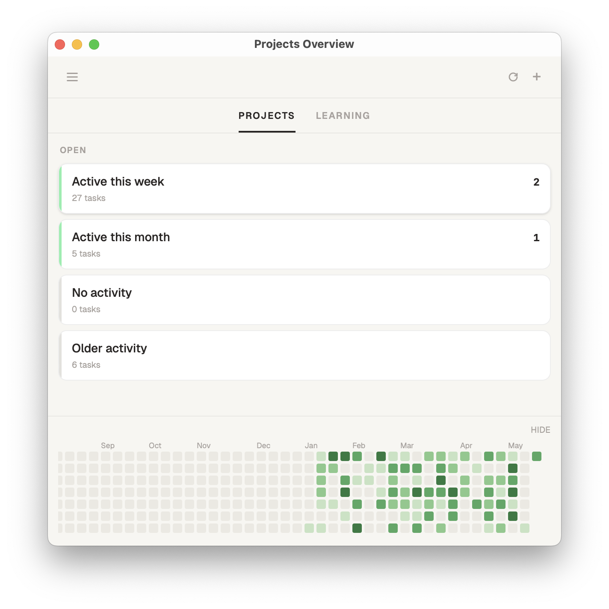

# Projects Overview (pov)

A macOS desktop app for tracking TODO.md files across projects. Built with Tauri + React frontend and a FastAPI Python backend.



## Prerequisites

- [Rust](https://rustup.rs/)
- [Node.js](https://nodejs.org/) (v18+)
- [uv](https://docs.astral.sh/uv/) (Python package manager)

## Development

Install dependencies:

```sh
npm install
uv sync --directory backend
```

Run the app in dev mode (hot-reloading frontend, live Python backend):

```sh
npm run tauri dev
```

The backend uses `~/.local/share/pov-dev/` for data in dev mode, keeping it separate from production data.

## Testing

Backend tests use pytest and run against a real SQLite database (no mocks):

```sh
cd backend
uv run pytest
```

## Build

Before the first build, generate the standalone Python binaries that get bundled into the app:

```sh
cd backend && uv run python build.py
```

This produces `src-tauri/binaries/pov-backend-*` and `src-tauri/binaries/pov-cli-*` via PyInstaller. The binaries are gitignored and must be regenerated after backend changes.

Then build the app:

```sh
npm run tauri build
```

The output is a `.dmg` at `src-tauri/target/release/bundle/dmg/`.

> `npm run tauri build` runs `build.py` automatically via `beforeBuildCommand`, so the manual step above is only needed when iterating on the binaries without a full app rebuild.

## Gatekeeper (first launch)

The app is unsigned. macOS blocks unsigned apps on first open. Fix with:

```sh
xattr -d com.apple.quarantine "/Applications/Projects Overview.app"
```

Or: right-click the `.app` in Finder → Open → click Open in the dialog.

## CLI

The app ships a `pov` CLI. Install it from **Settings → Install CLI** inside the app. It gets copied to `~/.local/bin/pov` — make sure that's on your `PATH`.

```sh
pov add path/to/TODO.md           # track a project
pov add path/to/TODO.md --type learning
pov list                          # list tracked projects
pov remove "project name"         # stop tracking
pov import-time "Maths" TIME.md   # import a time log into a project
```

`import-time` reads a markdown table of `| DATE | TIME | TOPIC |` rows, where
TIME is a number of hours (comma or dot separator), and records the entries
against the project's time heatmap. If the project already has time entries it
refuses to run, unless given `--append` (keep them) or `--replace` (drop them).

## Data locations

| Mode | Path |
|------|------|
| Production | `~/.local/share/pov/` |
| Dev | `~/.local/share/pov-dev/` |

Each directory contains a SQLite database (`pov.db`) and a git-tracked folder of hardlinked TODO.md files.
